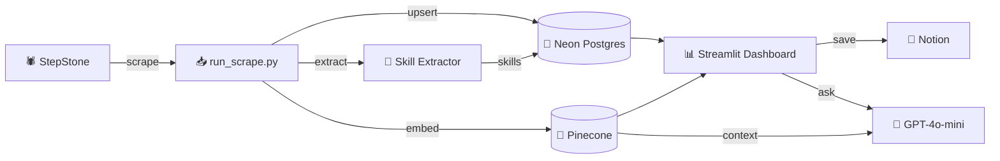

# 🎯 StellenRadar

> **Scraping-first job intelligence for the German data analytics market.**

StellenRadar scrapes real job postings, extracts skills, scores them against your profile, and surfaces actionable insights through an interactive Streamlit dashboard — all end-to-end.

---

## ✨ Key Features

| | Feature | Description |
|---|---|---|
| 🕷️ | **Live scraping** | Fetches real German job postings from StepStone — no static datasets |
| 🧠 | **Hybrid matching** | 7-component scoring: role keywords, location, skills, semantic similarity, freshness & more |
| 🇩🇪 | **Bilingual extraction** | Rule-based skill extractor with 70+ skills in German & English |
| 🔍 | **Semantic search** | Pinecone vector store + OpenAI embeddings for natural-language queries |
| 📊 | **Interactive dashboard** | Streamlit UI — profile match, RAG Q&A, skill trends, saved jobs |
| 📝 | **Notion integration** | One-click save creates a tracking page in your Notion board |
| 🤖 | **Profile-driven scraping** | Change your profile → scraper automatically fetches matching roles & cities |

---

## 🏗️ Architecture



---

## 📂 Repository Structure

```
app/
  config.py                 ⚙️  Settings loaded from .env
  profile.py                👤  User profile (roles, skills, weights)
  db/
    models.py               🗃️  SQLAlchemy models (Job, Skill, SavedJob, ...)
    session.py               🔌  DB engine / session factory
  scrapers/
    stepstone_scraper.py     🕷️  StepStone HTML scraper
    indeed_scraper.py        🧪  Indeed mock adapter
  services/
    skill_extractor.py       🔧  Rule-based skill extraction (DE + EN)
    matcher.py               🎯  Hybrid scoring engine
    pinecone_store.py        🌲  Embedding + Pinecone upsert / search
    notion_service.py        📝  Notion page creation
  agent/
    agent_core.py            🤖  Tool-orchestration layer
  telegram_bot/
    bot.py                   💬  Telegram bot interface
dashboard/
  streamlit_app.py           📊  Streamlit dashboard (4 pages)
scripts/
  run_scrape.py              🚀  Scrape → DB → Pinecone pipeline
  benchmark_quality.py       📏  Top-N match diagnostics
tests/                       🧪  pytest suite
.github/workflows/           ⚡  CI + daily scrape placeholder
learning_notebooks/          📓  Walkthrough notebooks & presentation prompts
```

---

## 🚀 Quick Start

### 1️⃣ Create & activate virtual environment

```bash
python -m venv .venv
.venv\Scripts\Activate.ps1      # Windows PowerShell
# source .venv/bin/activate     # macOS / Linux
```

### 2️⃣ Install dependencies

```bash
pip install -r requirements.txt
```

### 3️⃣ Configure environment variables

```bash
copy .env.example .env          # Windows
# cp .env.example .env          # macOS / Linux
```

Fill in the following:

| Variable | Purpose | Required? |
|---|---|---|
| `DATABASE_URL` | 🐘 Neon PostgreSQL connection string | ✅ Yes |
| `OPENAI_API_KEY` | 🧠 Embeddings + Ask-the-market answers | ✅ Yes |
| `PINECONE_API_KEY` | 🌲 Vector store | ✅ Yes |
| `PINECONE_INDEX` | 🌲 Pinecone index name | ✅ Yes |
| `NOTION_API_KEY` | 📝 Notion integration | ⬜ Optional |
| `NOTION_DATABASE_ID` | 📝 Notion database for saved jobs | ⬜ Optional |
| `TELEGRAM_BOT_TOKEN` | 💬 Telegram bot | ⬜ Optional |

### 4️⃣ Run the scraping pipeline

```bash
python -m scripts.run_scrape
```

This scrapes StepStone, upserts jobs into Postgres, extracts skills, and syncs vectors to Pinecone. The scraper reads your saved profile to decide which roles and cities to search — or uses sensible defaults on first run.

### 5️⃣ Launch the dashboard

```bash
streamlit run dashboard/streamlit_app.py
```

---

## 📊 Dashboard Pages

| Page | What it does |
|---|---|
| 🎯 **Profile Match** | Scores all jobs against your profile. Ranked table with clickable apply links, detailed score breakdowns, filters, and one-click Notion save |
| 💬 **Ask the market** | RAG-powered Q&A — ask natural-language questions answered by GPT-4o-mini grounded in your real job data. Includes clickable example questions |
| 📈 **Skill trends** | Bar chart + week-over-week trending table. Configurable threshold slider and category filter (technical / soft / language) |
| 💾 **Saved Jobs** | All jobs saved to Notion with direct links to both the job posting and your Notion page |

> 💡 You can also **run the scraper** and **re-extract skills** directly from the dashboard sidebar — no terminal needed.

---

## 🧠 Scoring Model

The hybrid match score combines **seven weighted components** (all editable from the dashboard):

| Component | Weight | How it works |
|---|---|---|
| 🏷️ Role keywords | `0.35` | Title + description matched against a bilingual keyword map |
| 📍 Location | `0.25` | Priority and secondary city matching |
| 🔧 Skill overlap | `0.40` | Your skills ∩ extracted job skills |
| 👀 Watch bonus | `0.15` | Extra credit for nice-to-have skills present |
| 🏭 Sector edge | `0.15` | Engineering / manufacturing / automotive signals |
| 🔍 Semantic | `0.20` | Cosine similarity between your profile and the job embedding |
| ⏰ Freshness | `0.10` | Full credit ≤ 3 days, decays to zero at 14 days |

---

## 👤 Personalisation

**No code changes needed** — edit everything from the dashboard sidebar:

1. Open the dashboard → expand **Edit matching profile**
2. Change your target roles, priority cities, skills, and weights
3. Click **Save profile settings**
4. Click **Run scraper** → it automatically searches your new roles & cities
5. Scores recalculate against your updated profile

> 🤖 **Pro tip:** Ask Claude or ChatGPT to analyse your CV and extract your roles, skills, and target cities in comma-separated format. Paste them straight into the sidebar fields.

---

## ⚡ GitHub Automation

- **CI** — install + import smoke checks on push / PR
- **Daily Scrape** *(placeholder)* — scheduled + manual trigger, ready for production credentials

---

## 🛠️ Tech Stack

| Layer | Technology |
|---|---|
| Scraping | `requests` + `BeautifulSoup` |
| Database | Neon PostgreSQL + `SQLAlchemy` |
| Embeddings | OpenAI `text-embedding-3-small` |
| Vector store | Pinecone |
| LLM | GPT-4o-mini (RAG answers) |
| Dashboard | Streamlit |
| Job tracking | Notion API |
| Bot | Telegram Bot API |
| CI | GitHub Actions |

---
**Goldie V* — [LinkedIn](https://www.linkedin.com/in/goldiev)
<p align="center">
  Built with ☕ and 🐍 for the German job market.
</p>
